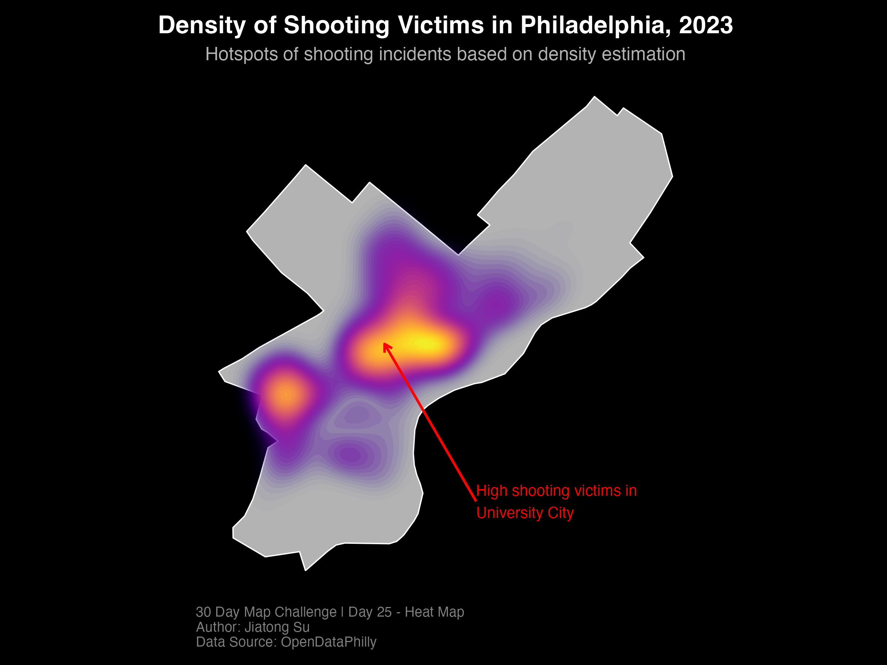

# Maps

## Table of Contents

   
Contents

1. [D1 - Points](#d1---points)
1. [D3 - Polygon](#d3---polygon)
1. [D4 - Hexagon](#d4---hexagon)
1. [D6 - Raster](#d6---raster)
1. [D11 - Open street map](#d11---open-street-map)
1. [D12 - Time and Space](#d12---time-and-space)
1. [D14 - World](#d14---world)
1. [D16 - Choropleth](#d16---choropleth)
1. [D22 - 2-colors](#d22---2-colors)
1. [D25 - Heat](#d25---heat)

## D1 - Points
This map visualizes primary and commercial airports across California. I use the airport symbol instead of the point, which improves readability and make it more engaging and intuitive for viewers to identify airport locations.

<a href="https://github.com/sujiatong/30DayMap-Jiatong/blob/1efd4d576fc0ee35befadf8189650e34846c3781/day_1_point/day_1_point.R">💻 Source Code</a>

## D3 - Polygon
This map visualizes Pennsylvania’s presidential election results at the county level, using blue and red to represent the winning party. The clear color distinction effectively highlights the electoral outcome across the state.

<a href="https://github.com/sujiatong/30DayMap-Jiatong/blob/d25386130a69d440b3d45689419a6f8cf6d434b0/day3_polygon/day3_polygon.Rmd">💻 Source Code</a>

## D4 - Hexagon
Here’s a visualization of collision counts across the Central West District (中西區) in Hong Kong. This map offers insights into areas with higher incidences of road collisions, potentially highlighting patterns and informing safer urban planning initiatives.
Check out [interactive map](https://sujiatong.github.io/30DayMap-Jiatong/day4_hext/day_4.html) for in-depth look at specific area.

<a href="https://github.com/sujiatong/30DayMap-Jiatong/blob/403a6899cd7e83acf6776f066a063a8e67179b48/day4_hext/hextagon_day4.Rmd">💻 Source Code</a>

## D6 - Raster
This map uses a gradient from pale to green to show vegetation density across Philadelphia, highlighting areas with sparse to lush greenery. A minimalist design with a vertical legend ensures clarity, emphasizing vegetation patterns while maintaining professional readability.

<a href="https://github.com/sujiatong/30DayMap-Jiatong/blob/403a6899cd7e83acf6776f066a063a8e67179b48/day4_hext/hextagon_day4.Rmd">💻 Source Code</a>

## D11 - Open street map

This map visualizes motorcycle casualties in Hong Kong using an OpenStreetMap base layer. A grid overlay represents the distribution and density of casualties, providing a clear spatial understanding of the data.

<a href="https://github.com/sujiatong/30DayMap-Jiatong/blob/main/day11-OSM/day11.Rmd">💻 Source Code</a>

## D12 - Time and Space
This map highlights how cartography and data visualization can bring history to life, offering insights into one of the most transformative eras in Chinese history. In this map, I use stack territorial polygon of each time period, and showing different color to distinguish changing of Territorial.

- 1820 (25th year of Jiaqing - 嘉慶二十五年): The Qing Dynasty’s territory was at its peak, but the nation’s strength began to decline (嘉道中衰).

- 1911 (3rd year of Xuantong - 宣統三年): By this time—the final year of the dynasty—foreign powers had seized large portions of land, and the empire’s borders were significantly reduced.
  

<a href="https://sujiatong.github.io/30DayMap-Jiatong/day12/day12.html">💻 Source Code</a>

## D14 - World
This map visualize the country population distribution around the world by using a gradient color scale. The varying colors enhance readability and allow viewers to quickly understand population scales across different countries.

<a href="https://github.com/sujiatong/30DayMap-Jiatong/blob/main/day14_world/day14_World.Rmd">💻 Source Code</a>

## D16 - Choropleth
This choropleth map illustrates the relationship between income and the percentage of the white population. Annotation text highlights significant patterns, while an appropriate color palatte ensures clarity and effective visual representation.

<a href="https://sujiatong.github.io/30DayMap-Jiatong/day16/day16.html">💻 Source Code</a>

## D22 - 2-colors
This two-color map highlights European Union countries in blue, effectively emphasizing and clearly distinguishing them from non-EU countries.

<a href="https://github.com/sujiatong/30DayMap-Jiatong/blob/main/day22-2colours/day22_2colours.Rmd">💻 Source Code</a>

## D25 - Heat
This heat map visualizes the density of shooting victims in Philadelphia, using hotspots to illustrate the areas of high concentration. Moreover, annotation text highlights key areas and patterns, improving clarity and providing additional context for the data.

<a href="https://sujiatong.github.io/30DayMap-Jiatong/day25/day25-heat_map.html">💻 Source Code</a>
